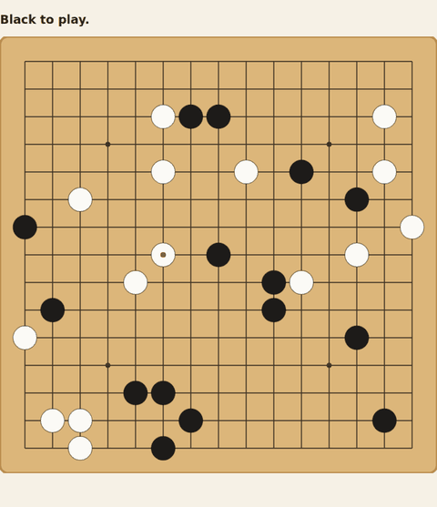
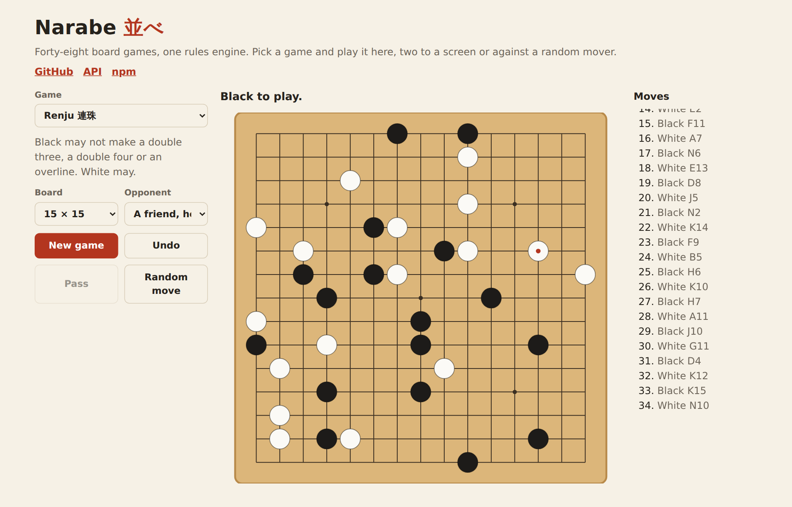
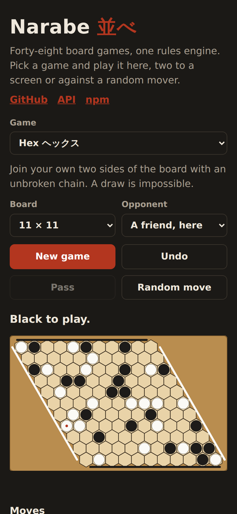

<h1 align="center">Narabe <sub>並べ</sub></h1>

<p align="center"><strong>One rules engine for forty-eight abstract board games.</strong><br>
Gomoku and renju, Connect Four, tic-tac-toe, Reversi, Hex, Go, Halma, Chinese Checkers, checkers and five draughts rule sets. Every game is a row of data, every move returns a new state, and nothing depends on anything.</p>

<p align="center">
  <a href="https://github.com/johnmorrisdotca/narabe/actions/workflows/ci.yml"></a>
  <a href="https://www.npmjs.com/package/@johnmorrisdotca/narabe"></a>
  <a href="./LICENSE"></a>
  
  
  
</p>

<p align="center"><a href="https://johnmorrisdotca.github.io/narabe/"><strong>Play any of them →</strong></a></p>

<p align="center">
  
</p>

*Narabe* means "line them up", as in *gomoku-narabe*, the Japanese name for
five in a row. It began as the rules behind [Itsutsu](https://itsutsu.com), a
site where people play all of these games against each other and against
graded computer players, and it is the same code the site runs.

<p align="center">
  
  
</p>

## Features

- **Forty-eight games, one engine.** Lines, drops, captures, flips, races,
  connections, territory and jumps. Each game is one row in `VARIANT_SPECS`,
  and the engine reads the row's fields rather than the game's name, so games
  that share a mechanism share its code, and a new game is often a new row.
- **Square boards and the hexagon lattice.** Hex's rhombus, a hexagon of
  hexagons and the Chinese Checkers star all live on the same square grid,
  with the lattice's six directions and the cells outside the shape sealed.
  Boards can wrap into a cylinder or a torus, carry dead squares, hotspots
  and wormholes, grow and shrink mid-game, or have gravity from one edge or
  all four.
- **Pure and immutable.** Every function takes a `GameState` and returns a new
  one. An illegal move returns the state it was given, unchanged, so a caller
  can test `next === state` and never needs a try block.
- **Reproducible.** Anything decided by chance (where the rocks fall, the next
  domino, who opens) comes from a seed stored in the settings. A game is a
  move list, and replaying it through the same engine can never disagree with
  the game that was played.
- **The real rules, down to the corners.** Renju's forbidden double three,
  double four and overline for Black; Caro's blocked five; Go's suicide, simple
  ko and area scoring with komi; Reversi's forced pass; forced and maximal
  captures, flying kings, crowning mid-capture, repetition and endgame counts
  across six checkers and draughts rule sets; seven opening protocols (pro,
  long pro, swap, swap2, RIF, Sakata, Tarannikov); handicaps, head starts and
  a draw limit.
- **Checked twice.** Every game is played to its end, over and over, by a
  simulator that re-checks each move against the rules written out a second
  way, by hand. 587 tests in all.
- **Small, typed and dependency-free.** ES modules with full TypeScript types,
  a plain-function core that runs in any browser, Node, Deno or Bun, and an
  optional React hook.

## Install

```sh
pnpm add @johnmorrisdotca/narabe
```

ES modules with TypeScript types. The engine has no dependencies; the React
hook needs React 18 or later.

## Quick start

```ts
import { createGame, playMove, pointName, RULE_VARIANTS } from "@johnmorrisdotca/narabe";

let game = createGame({ variant: RULE_VARIANTS.renju, size: 15 });
game = playMove(game, { row: 7, col: 7 });   // Black takes the centre
game = playMove(game, { row: 7, col: 8 });   // White answers beside it

game.toPlay;                                 // "black"
game.status;                                 // "playing"
pointName(15, { row: 7, col: 7 });           // "H8"
playMove(game, { row: 7, col: 7 }) === game; // true: an occupied point changes nothing
```

### Games where pieces move

```ts
import { createGame, movePiece, pieceMoves, turnChoices } from "@johnmorrisdotca/narabe";

let board = createGame({ variant: "checkers" });
const choices = turnChoices(board);
// { kind: "move", pieces: [{ row: 2, col: 1 }, …], count: 7, narrowedBy: null }

const from = choices.pieces[0];
board = movePiece(board, from, pieceMoves(board, from)[0]);
```

`turnChoices` answers "what may the player to move do?" for every game: the
pieces that can move, or the points that can be played, and the rule that
narrowed them (a forced capture, say). It is what a board needs to highlight
moves without knowing any rules itself.

### In React

```tsx
import { useNarabe } from "@johnmorrisdotca/narabe/react";

export function Reversi() {
  const { state, choices, play, undo, canUndo } = useNarabe({ variant: "reversi" });
  // Draw state.board your own way, call play(point) on a click,
  // and mark choices.points as the legal moves.
}
```

### Saving and replaying a game

A game is stored as its settings and a list of moves. Nothing else is needed
to rebuild every position it passed through.

```ts
import { createGame, replayMoves } from "@johnmorrisdotca/narabe";

const record = game.moves.map(({ row, col, kind }) => ({ row, col, kind }));
const positions = replayMoves(createGame(game.settings), record);
positions.at(-1);   // the game as it stands, rebuilt from its record
```

## The games

| Family | Games |
| --- | --- |
| Five in a row | Gomoku (`freestyle`), Tournament Gomoku (`standard`), Renju (`renju`), Omok (`omok`), Caro (`caro`), Connect6 (`connect6`), Misère Five (`misereFive`), Hex Five (`hexFive`) |
| Captures | Ninuki-renju (`ninuki`), Sannuki-renju (`sannuki`) |
| Drops | Drop Four (`dropFour`), Ring Drop (`ringDrop`), Hole Drop (`holeDrop`), Hot Drop (`hotDrop`), Clear Drop (`clearDrop`), Giveaway Drop (`giveawayDrop`), Edge Drop (`edgeDrop`), Wormhole Drop (`wormDrop`) |
| Small boards | Tic-tac-toe (`tictactoe`), Wild Tic-tac-toe (`wildTicTacToe`), Notakto (`notakto`), Trap Three (`trapThree`), Square Four (`squareFour`), Maker and Breaker (`makerBreaker`) |
| Strange boards | Toroidal Five (`toroidalFive`), Obstacle Five (`obstacleFive`), Scattered Rocks (`scatteredRocks`), Rockfall (`rockfall`), Domino Five (`dominoFive`), Block Five (`blockFive`), Twist Five (`twistFive`), Twist Four (`twistFour`) |
| Flipping | Reversi (`reversi`), Classic Reversi (`classicReversi`), Anti-Reversi (`antiReversi`), Mini Reversi (`miniReversi`), Grand Reversi (`grandReversi`), Honeycomb (`honeycomb`) |
| Races | Halma (`halma`), Chinese Checkers (`chineseCheckers`) |
| Connection and territory | Hex (`hex`), Go (`go`) |
| Checkers and draughts | Checkers (`checkers`), International Draughts (`internationalDraughts`), Brazilian Draughts (`brazilianDraughts`), Canadian Checkers (`canadianCheckers`), Russian Draughts (`russianDraughts`), Pool Checkers (`poolCheckers`) |

The key in brackets is the game's `RuleVariant`. `RULE_VARIANT_LIST` lists
them all, `boardSizesFor(variant)` says which boards each is played on, and
`VARIANT_SPECS[variant]` is its row of rules.

The engine holds no names or rules text, on purpose: those belong to the app
that shows the games, in its own words and languages. The names above are the
ones [Itsutsu](https://itsutsu.com/games) uses.

## API

Everything below is exported from the package root, and every type is
exported too. Deeper modules are reachable by path, such as
`@johnmorrisdotca/narabe/rules/go`, for the pieces the root leaves out.

### Starting a game

```ts
createGame(settings?: Partial<GameSettings>, roll?: number): GameState
normaliseSettings(settings: GameSettings): GameSettings  // clamps a size, a line length, an opening
availableOpenings(settings: GameSettings): OpeningRule[]
boardSizesFor(variant: RuleVariant): readonly number[]
defaultBoardFor(variant: RuleVariant): number

type GameSettings = {
  variant: RuleVariant; size: number; winLength: number;
  opening: OpeningRule;           // "free", "pro", "swap2", "rif", …
  handicap: Handicap; headStart: HeadStart;
  seed: number;                   // decides everything left to chance
  capturesToWin: number; firstPlayer: "black" | "white" | "random";
  obstacles: "none" | "hoshi"; drawLimit: "none" | "half" | "threeQuarters";
  allowUndo: boolean; allowSkip: boolean; allowSwap: boolean; swapsPerSeat: number; allowResize: boolean;
};
```

`roll`, a number from 0 to 1, draws the seed and a random opener where the
settings leave them open. Pass `Math.random()` for a fresh game.

### Playing

```ts
playMove(state, point, kind?, colour?): GameState    // place a stone; colour where the mover picks it
movePiece(state, from, to): GameState                 // step, slide or jump
placePiece(state, cells): GameState                   // lay a queued domino or block
twistBoard(state, quadrant, clockwise): GameState     // finish a twist game's move
passTurn(state): GameState
chooseColour(state, stone) / extendOpening(state)     // the swap openings' decisions
swapSeats(state) / resign(state, loser) / winOnTime(state, loser) / forfeitTurn(state)
growBoard(state) / shrinkBoard(state)
undoMove(state): GameState
skipMove(state, roll?): GameState
```

Each returns the state unchanged when the move is not allowed. The `can…`
questions say so first: `isLegalMove`, `canPass`, `mustPass`, `canTwist`,
`canUndo`, `canSkip`, `canSwapSeats`, `canChooseColour`, `canExtendOpening`,
`canGrowBoard`, `canShrinkBoard`.

### Asking

```ts
turnChoices(state): TurnChoices | null   // what the player to move may do
legalPoints(state): Point[]              // every point a stone may go now
pieceMoves(state, from): Point[]         // where the piece on `from` may go
piecePlacements(state): PieceCell[][]    // every fit for the queued piece
forbiddenPoints(state): Point[]          // renju's and omok's forbidden shapes
forbiddenReason(state, point): ForbiddenPattern | null
findWinningLine(board, settings, point): Point[]
rulesFor(settings, stone): ColourRules   // the rules for one colour, handicap included
discCount(board) / scoreArea(board, size) / piecesHome(…)
lastMove(state): Point | null
longestPossibleGame(settings): number | null
endsOnItsOwn(settings): boolean          // false where pieces can wander for ever
```

A finished game has `status` `"won"` or `"draw"`, `winner`, `winBy` (a
`WinReason` such as `"line"`, `"captures"`, `"count"`, `"camp"`,
`"connection"`, `"territory"` or `"blocked"`) and, for a line, the
`winningLine`.

### The board

```ts
type Cell = "black" | "white" | "blocked" | "hot" | "worm" | null;
type Point = { row: number; col: number };

state.board: Cell[]                      // row-major, size × size
indexOf(size, point) / pointOf(size, index) / isOnBoard(size, point)
otherStone(stone)
```

`VARIANT_SPECS[variant].grid` says how a game is traditionally drawn: on the
crossings of the lines (`"lines"`, like Go) or inside the squares (`"cells"`,
like checkers). The hexagon-lattice games (`connects`, `hexagon`,
`chineseCheckers` on the spec) are drawn with each row slid half a cell:
`x = col + row / 2`, `y = row × √3 / 2`.

### Records and notation

```ts
replayMoves(start, moves, choices?, facts?): GameState[]   // every position a record passed through
replayGame(stored: StoredGame): GameState                  // a stored game, as it stands
replayTimeline(stored: StoredGame): GameState[]
pointName(size, point): string            // "H8", counted from the bottom, with no I column
columnLetter(col) / rowNumber(size, row)
stonelessWord(kind): string | null        // "pass" or "timed out", for a move with no point
seededRandom(seed): () => number          // the generator every seeded choice uses
```

### Constants

`RULE_VARIANTS`, `RULE_VARIANT_LIST`, `VARIANT_SPECS`, `STONES`,
`GAME_STATUS`, `MOVE_KINDS`, `WIN_REASONS`, `OPENING_RULES`, `DRAW_LIMITS`,
`DEFAULT_SETTINGS`, `STAR_POINTS` and the rest compare a value without a
string literal: `state.status === GAME_STATUS.won`.

### React

```ts
useNarabe(settings?): {
  state: GameState; choices: TurnChoices | null;
  play(point, kind?, colour?): void; move(from, to): void; place(cells): void;
  twist(quadrant, clockwise): void; pass(): void;
  undo(): void; canUndo: boolean; reset(settings?): void;
}
```

## Browser support

Any browser from the last few years: the engine needs ES2020 and nothing else.
It also runs in Node 20 and later, Deno and Bun. The demo is a static page with
no build step beyond the package's own.

## Roadmap

- **narabe-bots**, the computer players, as a companion package beside this
  one (`@johnmorrisdotca/narabe-bots`): graded players from a random mover to
  a threat-space search, and specialists for Reversi, Go, draughts and the
  races. Apart, so that a project that wants only the rules never downloads a
  search
- Seeded choices through [Tane](https://github.com/johnmorrisdotca/tane), the
  family's seeded-random package
- Standard notations in and out: SGF for Go, PDN for draughts, RIF records for
  renju
- A board component for React on top of `turnChoices`
- More games: Pente, Lines of Action, Breakthrough, Amazons

Ideas and pull requests are welcome.

## Contributing

See [CONTRIBUTING.md](./CONTRIBUTING.md), which also says how to add a game. In
short:

```sh
pnpm install
pnpm check   # lint, types and tests
pnpm site    # build the demo into ./site, then serve it
```

Please follow the [code of conduct](./CODE_OF_CONDUCT.md).

## Changes

See [CHANGELOG.md](./CHANGELOG.md).

## Licence

[MIT](./LICENSE) © John Morris
