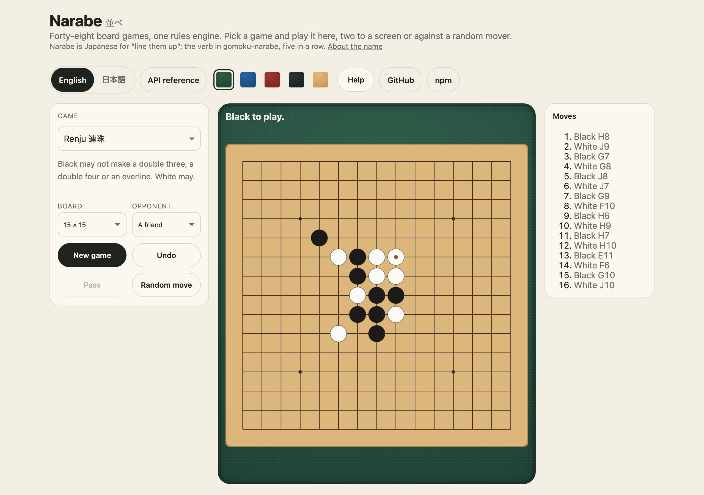
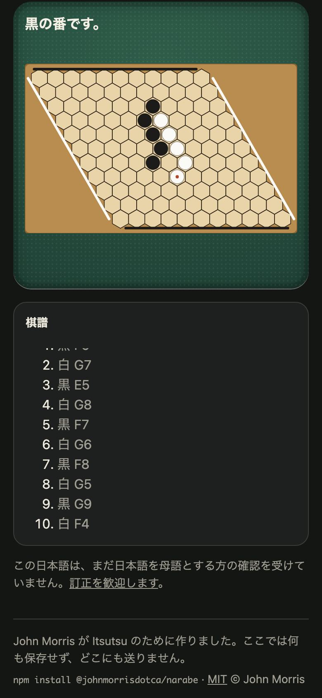

<h1 align="center">Narabe <sub>並べ</sub></h1>

<p align="center"><strong>One rules engine for forty-eight abstract board games.</strong><br>
Gomoku and renju, Connect Four, tic-tac-toe, Reversi, Hex, Go, Halma, Chinese Checkers, checkers and five draughts rule sets. Every game is a row of data, every move returns a new state, and nothing depends on anything.</p>

<p align="center">
  <a href="https://github.com/johnmorrisdotca/narabe/actions/workflows/ci.yml"></a>
  <a href="https://www.npmjs.com/package/@johnmorrisdotca/narabe"></a>
  <a href="./LICENSE"></a>
  
  
  
</p>

<p align="center"><a href="https://johnmorrisdotca.github.io/narabe/"><strong>Play any of them →</strong></a> · <a href="https://johnmorrisdotca.github.io/narabe/api.html">API reference</a></p>

<p align="center">
  
</p>

*Narabe* means "line them up", as in *gomoku-narabe*, the Japanese name for
five in a row. It began as the rules behind [Itsutsu](https://itsutsu.com), a
site where people play all of these games against each other and against
graded computer players, and it is the same code the site runs.

<p align="center">
  
  
</p>

## In 30 seconds

```sh
npm install @johnmorrisdotca/narabe    # or pnpm add, or yarn add
```

```ts
import { createGame, playMove, RULE_VARIANTS } from "@johnmorrisdotca/narabe";

let game = createGame({ variant: RULE_VARIANTS.renju, size: 15 });
game = playMove(game, { row: 7, col: 7 });   // Black takes the centre
game.toPlay;                                 // "white"
```

Or, with nothing to install:

```sh
npx @johnmorrisdotca/narabe play hex --size 11 --seed 7
```

## Who it is for

- **Anybody building a board-game site or app.** The rules, legal moves,
  results and records of forty-eight games are done behind one set of
  functions, and `turnChoices` tells a board what to highlight without knowing
  a rule. You draw the board, or take the SVG one.
- **Computer players and research.** Pure functions over plain data, so a
  search can copy a state freely and play a million games in a loop. A bot is
  yours to write; this is what it plays on.
- **Teaching and rulebooks.** Each game's rules are a row of data and a few
  modules, with tests beside them, and a second hand-written statement of the
  rules that the simulator checks them against.

## Features

- **Forty-eight games, one engine.** Lines, drops, captures, flips, races,
  connections, territory and jumps. Each game is one row in `VARIANT_SPECS`,
  and the engine reads the row's fields rather than the game's name, so games
  that share a mechanism share its code, and a new game is often a new row.
- **Square boards and the hexagon lattice.** Hex's rhombus, a hexagon of
  hexagons and the Chinese Checkers star all live on the same square grid,
  with the lattice's six directions and the cells outside the shape sealed.
  Boards can wrap into a cylinder or a torus, carry dead squares, hotspots
  and wormholes, grow and shrink mid-game, or have gravity from one edge or
  all four.
- **Pure and immutable.** Every function takes a `GameState` and returns a new
  one. An illegal move returns the state it was given, unchanged, so a caller
  can test `next === state` and never needs a try block.
- **Reproducible.** Anything decided by chance (where the rocks fall, the next
  domino, who opens) comes from a seed stored in the settings. A game is a
  move list, and replaying it through the same engine can never disagree with
  the game that was played.
- **The real rules, down to the corners.** Renju's forbidden double three,
  double four and overline for Black; Caro's blocked five; Go's suicide, simple
  ko and area scoring with komi; Reversi's forced pass; forced and maximal
  captures, flying kings, crowning mid-capture, repetition and endgame counts
  across six checkers and draughts rule sets; seven opening protocols (pro,
  long pro, swap, swap2, RIF, Sakata, Tarannikov); handicaps, head starts and
  a draw limit.
- **Checked twice.** Every game is played to its end, over and over, by a
  simulator that re-checks each move against the rules written out a second
  way, by hand. Hundreds of tests in all.
- **Small, typed and dependency-free.** ES modules with full TypeScript types,
  a plain-function core that runs in any browser, Node, Deno or Bun, and an
  optional React hook.
- **A picture of any position.** `boardSvg(state)` draws it as one SVG string,
  the way its game is traditionally drawn, in colours a page can restyle.
- **A command line**, `narabe`, that lists the games, draws a starting board,
  plays a game out at random and reads a saved game back through the engine.

## Install

```sh
npm install @johnmorrisdotca/narabe
# or: pnpm add @johnmorrisdotca/narabe
```

ES modules with TypeScript types. The engine has no dependencies; the React
hook needs React 18 or later.

## Use it in your project

### The engine alone

```ts
import { createGame, playMove, pointName, RULE_VARIANTS } from "@johnmorrisdotca/narabe";

let game = createGame({ variant: RULE_VARIANTS.renju, size: 15 });
game = playMove(game, { row: 7, col: 7 });   // Black takes the centre
game = playMove(game, { row: 7, col: 8 });   // White answers beside it

game.toPlay;                                 // "black"
game.status;                                 // "playing"
pointName(15, { row: 7, col: 7 });           // "H8"
playMove(game, { row: 7, col: 7 }) === game; // true: an occupied point changes nothing
```

### Games where pieces move

```ts
import { createGame, movePiece, pieceMoves, turnChoices } from "@johnmorrisdotca/narabe";

let board = createGame({ variant: "checkers" });
const choices = turnChoices(board);
// { kind: "move", pieces: [{ row: 2, col: 1 }, …], count: 7, narrowedBy: null }

const from = choices.pieces[0];
board = movePiece(board, from, pieceMoves(board, from)[0]);
```

`turnChoices` answers "what may the player to move do?" for every game: the
pieces that can move, or the points that can be played, and the rule that
narrowed them (a forced capture, say). It is what a board needs to highlight
moves without knowing any rules itself.

### In React

```tsx
import { useNarabe } from "@johnmorrisdotca/narabe/react";

export function Reversi() {
  const { state, choices, play, undo, canUndo } = useNarabe({ variant: "reversi" });
  // Draw state.board your own way, call play(point) on a click,
  // and mark choices.points as the legal moves.
}
```

### Drawing a board

```ts
import { boardSvg } from "@johnmorrisdotca/narabe/draw";

element.innerHTML = boardSvg(game, { width: 400, title: "Renju, move 2" });
```

The string is one `<svg>` element, so it can be a file, an `innerHTML` or part
of a server-rendered page. Lines games are drawn on the crossings, checkers and
Reversi in squares, Hex and Chinese Checkers on the hexagon lattice. It draws a
state it is given and decides nothing. Or draw your own: `VARIANT_SPECS[variant].grid`
says how a game is traditionally drawn, and `turnChoices` says what to mark.

### Saving and replaying a game

A game is stored as its settings and a list of moves. Nothing else is needed
to rebuild every position it passed through.

```ts
import { createGame, replayMoves } from "@johnmorrisdotca/narabe";

const record = game.moves.map(({ row, col, kind }) => ({ row, col, kind }));
const positions = replayMoves(createGame(game.settings), record);
positions.at(-1);   // the game as it stands, rebuilt from its record
```

## Where it comes from, and where it is used

It is the rules behind [Itsutsu](https://itsutsu.com), a site where people play
all of these games against each other and against graded computer players, and
it is the same code the site runs: Itsutsu installs this package at a released
version. The [demo](https://johnmorrisdotca.github.io/narabe/) plays any of
them in the browser.

**Using it somewhere? [Tell us](https://github.com/johnmorrisdotca/narabe/issues/new?template=add-my-project.md).**

## The games

| Family | Games |
| --- | --- |
| Five in a row | Gomoku (`freestyle`), Tournament Gomoku (`standard`), Renju (`renju`), Omok (`omok`), Caro (`caro`), Connect6 (`connect6`), Misère Five (`misereFive`), Hex Five (`hexFive`) |
| Captures | Ninuki-renju (`ninuki`), Sannuki-renju (`sannuki`) |
| Drops | Drop Four (`dropFour`), Ring Drop (`ringDrop`), Hole Drop (`holeDrop`), Hot Drop (`hotDrop`), Clear Drop (`clearDrop`), Giveaway Drop (`giveawayDrop`), Edge Drop (`edgeDrop`), Wormhole Drop (`wormDrop`) |
| Small boards | Tic-tac-toe (`tictactoe`), Wild Tic-tac-toe (`wildTicTacToe`), Notakto (`notakto`), Trap Three (`trapThree`), Square Four (`squareFour`), Maker and Breaker (`makerBreaker`) |
| Strange boards | Toroidal Five (`toroidalFive`), Obstacle Five (`obstacleFive`), Scattered Rocks (`scatteredRocks`), Rockfall (`rockfall`), Domino Five (`dominoFive`), Block Five (`blockFive`), Twist Five (`twistFive`), Twist Four (`twistFour`) |
| Flipping | Reversi (`reversi`), Classic Reversi (`classicReversi`), Anti-Reversi (`antiReversi`), Mini Reversi (`miniReversi`), Grand Reversi (`grandReversi`), Honeycomb (`honeycomb`) |
| Races | Halma (`halma`), Chinese Checkers (`chineseCheckers`) |
| Connection and territory | Hex (`hex`), Go (`go`) |
| Checkers and draughts | Checkers (`checkers`), International Draughts (`internationalDraughts`), Brazilian Draughts (`brazilianDraughts`), Canadian Checkers (`canadianCheckers`), Russian Draughts (`russianDraughts`), Pool Checkers (`poolCheckers`) |

The key in brackets is the game's `RuleVariant`. `RULE_VARIANT_LIST` lists
them all, `boardSizesFor(variant)` says which boards each is played on, and
`VARIANT_SPECS[variant]` is its row of rules.

The engine holds no names or rules text, on purpose: those belong to the app
that shows the games, in its own words and languages. The names above are the
ones [Itsutsu](https://itsutsu.com/games) uses.

## Limits

| Limit | Value | Constant |
| --- | --- | --- |
| Games | 48 | `RULE_VARIANT_LIST` |
| Players | two colours, Black and White | `STONES` |
| Board sides | 3 to 19; each game offers some of them | `ALL_BOARD_SIZES`, `boardSizesFor(variant)` |
| Rule sets of checkers and draughts | 6 | `VARIANT_SPECS[…].checkers` |
| Opening protocols besides none | 7 | `OPENING_RULE_LIST` |
| A seed | a whole number below 2,147,483,648, when the engine draws one | `SEED_RANGE` |
| The command line's seed | a whole number from 0 to 2,147,483,647 | |
| The command line's `--games` | 1 to 10,000 | |

`createGame` brings settings that disagree with their game into line (a pinned
line length wins over the player's choice, an opening the game does not offer
falls back to free) rather than refusing them, and every move function returns
the state it was given when a move is not allowed.

## Languages

The engine speaks in constants, never in words: `RULE_VARIANTS.renju`,
`WIN_REASONS.captures`. Names, rules text and pictures belong to the app that
shows the games, in its own languages; the names in the table above are the
ones [Itsutsu](https://itsutsu.com/games) uses, and the demo page has its own
English and Japanese.

The command line is the one thing here that talks, and it speaks English and
Japanese (`--lang`, or the environment's language). **The Japanese is not yet
reviewed by a native reader. Corrections welcome.** Every Japanese string of
the command line is listed beside its English in
[docs/strings-ja.md](./docs/strings-ja.md), and there is an
[issue template](https://github.com/johnmorrisdotca/narabe/issues/new?template=fix-a-translation.md)
for fixing one.

## The command line

```sh
npx @johnmorrisdotca/narabe games                                 # every game, with its boards
npx @johnmorrisdotca/narabe board renju --size 9                  # a starting position, as text
npx @johnmorrisdotca/narabe play renju --size 9 --seed 7          # random play to the end
npx @johnmorrisdotca/narabe play hex --size 11 --seed 7 --record > hex.json
npx @johnmorrisdotca/narabe replay hex.json                       # read it back through the engine
npx @johnmorrisdotca/narabe simulate reversi --games 200 --seed 1 # count how random games end
```

| Command or option | What it does |
| --- | --- |
| `games` | lists every game with the boards it is played on and the one it opens on |
| `board <game>` | prints the starting position as text: X for Black, O for White, `#` for a sealed square |
| `play <game>` | random play to the end, or until it is called off; prints the position and the result |
| `replay <file>` | reads a saved game back through the engine, from a file or from `--stdin`; exits 1 if the engine cannot play it out |
| `simulate <game>` | plays many random games and counts Black's wins, White's wins, draws and games not finished |
| `-s`, `--seed N` | the number a game's chance comes from; a fresh one is named on standard error if not given |
| `--size N` | the board's side; the one the game opens on if not given |
| `--games N` | `simulate`: how many games |
| `--record` | `play`: prints the saved game as JSON, ready for `replay` |
| `--stdin` | `replay`: reads the saved game from standard input |
| `-j`, `--json` | prints JSON |
| `--lang L` | `en` or `ja` |

The moves are random: this is a way to see the engine work and to check a
record, not a player. A game of moving pieces need not end under random play,
so `play` calls it off after a while and says so. The exit code is 0 when all
went well, 1 when what was asked for could not be done and 2 when the command
itself was wrong. The same seed plays the same game on every machine.

## API

The [API reference](https://johnmorrisdotca.github.io/narabe/api.html) lists every export of every entry point with its signature and its doc comment. It is made from the source by `pnpm site`, so it cannot fall behind the code.

Everything below is exported from the package root, and every type is
exported too. Deeper modules are reachable by path, such as
`@johnmorrisdotca/narabe/rules/go`, for the pieces the root leaves out.

### Starting a game

```ts
createGame(settings?: Partial<GameSettings>, roll?: number): GameState
normaliseSettings(settings: GameSettings): GameSettings  // clamps a size, a line length, an opening
availableOpenings(settings: GameSettings): OpeningRule[]
boardSizesFor(variant: RuleVariant): readonly number[]
defaultBoardFor(variant: RuleVariant): number

type GameSettings = {
  variant: RuleVariant; size: number; winLength: number;
  opening: OpeningRule;           // "free", "pro", "swap2", "rif", …
  handicap: Handicap; headStart: HeadStart;
  seed: number;                   // decides everything left to chance
  capturesToWin: number; firstPlayer: "black" | "white" | "random";
  obstacles: "none" | "hoshi"; drawLimit: "none" | "half" | "threeQuarters";
  allowUndo: boolean; allowSkip: boolean; allowSwap: boolean; swapsPerSeat: number; allowResize: boolean;
};
```

`roll`, a number from 0 to 1, draws the seed and a random opener where the
settings leave them open. Pass `Math.random()` for a fresh game.

### Playing

```ts
playMove(state, point, kind?, colour?): GameState    // place a stone; colour where the mover picks it
movePiece(state, from, to): GameState                 // step, slide or jump
placePiece(state, cells): GameState                   // lay a queued domino or block
twistBoard(state, quadrant, clockwise): GameState     // finish a twist game's move
passTurn(state): GameState
chooseColour(state, stone) / extendOpening(state)     // the swap openings' decisions
swapSeats(state) / resign(state, loser) / winOnTime(state, loser) / forfeitTurn(state)
growBoard(state) / shrinkBoard(state)
undoMove(state): GameState
skipMove(state, roll?): GameState
```

Each returns the state unchanged when the move is not allowed. The `can…`
questions say so first: `isLegalMove`, `canPass`, `mustPass`, `canTwist`,
`canUndo`, `canSkip`, `canSwapSeats`, `canChooseColour`, `canExtendOpening`,
`canGrowBoard`, `canShrinkBoard`.

### Asking

```ts
turnChoices(state): TurnChoices | null   // what the player to move may do
legalPoints(state): Point[]              // every point a stone may go now
pieceMoves(state, from): Point[]         // where the piece on `from` may go
piecePlacements(state): PieceCell[][]    // every fit for the queued piece
forbiddenPoints(state): Point[]          // renju's and omok's forbidden shapes
forbiddenReason(state, point): ForbiddenPattern | null
findWinningLine(board, settings, point): Point[]
rulesFor(settings, stone): ColourRules   // the rules for one colour, handicap included
discCount(board) / scoreArea(board, size) / piecesHome(…)
lastMove(state): Point | null
longestPossibleGame(settings): number | null
endsOnItsOwn(settings): boolean          // false where pieces can wander for ever
```

A finished game has `status` `"won"` or `"draw"`, `winner`, `winBy` (a
`WinReason` such as `"line"`, `"captures"`, `"count"`, `"camp"`,
`"connection"`, `"territory"` or `"blocked"`) and, for a line, the
`winningLine`.

### The board

```ts
type Cell = "black" | "white" | "blocked" | "hot" | "worm" | null;
type Point = { row: number; col: number };

state.board: Cell[]                      // row-major, size × size
indexOf(size, point) / pointOf(size, index) / isOnBoard(size, point)
otherStone(stone)
```

`VARIANT_SPECS[variant].grid` says how a game is traditionally drawn: on the
crossings of the lines (`"lines"`, like Go) or inside the squares (`"cells"`,
like checkers). The hexagon-lattice games (`connects`, `hexagon`,
`chineseCheckers` on the spec) are drawn with each row slid half a cell:
`x = col + row / 2`, `y = row × √3 / 2`.

### Records and notation

```ts
replayMoves(start, moves, choices?, facts?): GameState[]   // every position a record passed through
replayGame(stored: StoredGame): GameState                  // a stored game, as it stands
replayTimeline(stored: StoredGame): GameState[]
pointName(size, point): string            // "H8", counted from the bottom, with no I column
columnLetter(col) / rowNumber(size, row)
stonelessWord(kind): string | null        // "pass" or "timed out", for a move with no point
seededRandom(seed): () => number          // the generator every seeded choice uses
```

### Constants

`RULE_VARIANTS`, `RULE_VARIANT_LIST`, `VARIANT_SPECS`, `STONES`,
`GAME_STATUS`, `MOVE_KINDS`, `WIN_REASONS`, `OPENING_RULES`, `DRAW_LIMITS`,
`DEFAULT_SETTINGS`, `STAR_POINTS` and the rest compare a value without a
string literal: `state.status === GAME_STATUS.won`.

### Drawing

```ts
boardSvg(state, options?): string        // one <svg> element, from "@johnmorrisdotca/narabe/draw"

type DrawBoardOptions = {
  width?: number; title?: string;        // pixels; what a screen reader says
  lastMove?: boolean; winningLine?: boolean;   // marked unless false
  forbidden?: boolean; legal?: boolean;  // off unless asked
  selected?: Point;                      // a piece picked up
}
```

### React

```ts
useNarabe(settings?): {
  state: GameState; choices: TurnChoices | null;
  play(point, kind?, colour?): void; move(from, to): void; place(cells): void;
  twist(quadrant, clockwise): void; pass(): void;
  undo(): void; canUndo: boolean; reset(settings?): void;
}
```

## Theming

`boardSvg` paints with CSS variables that each have a default, so a page
restyles a board from outside: `--nb-wood`, `--nb-wood-deep`, `--nb-line`,
`--nb-cell-light`, `--nb-cell-dark`, `--nb-black`, `--nb-white`, `--nb-accent`,
`--nb-good`, `--nb-hot` and `--nb-worm`. Set them on the element holding the SVG
or on any ancestor. The engine and the React hook draw nothing, so have no
theme.

## Browser support

Any browser from the last few years: the engine needs ES2020 and nothing else,
and the SVG is plain SVG with CSS variables. It also runs in Node 22 and later,
Deno and Bun, and is tested in Node 22 and 24 on Linux, macOS and Windows,
installed from the tarball npm makes. The demo is a static page with no build
step beyond the package's own, and its tests run in Chromium and WebKit,
Safari's engine.

## Architecture

Every game is a row of data in the variants table, and the engine reads the
row, never the game's name, so games that share a mechanism share its code.
The engine itself (`engine.ts`) is small: it asks one module under `rules/`
for each mechanic (lines, captures, flips, checkers, Go and the rest) and
every function returns a new game. The rules are checked a second way by
`simulation/`, which plays whole games and restates each family's rules by
hand, so a wrong row cannot agree with itself.

```text
src/
├── board.constants.ts    the board's geometry: line directions, star points and column letters
├── cli.ts                the command line as a pure function, with its words in English and Japanese
├── constants.ts          the table of variants, the choices they are made from, and every number the rules use
├── draw.ts               the "/draw" entry: a position as one SVG string, drawn the way its game is traditionally drawn
├── engine.ts             the engine: create a game, ask what is legal, play a move, pass, forfeit
├── index.ts              the main entry: the engine, the variants table, notation, replay and everything the rules modules export
├── length.ts             how long a game can get, and what stops one that would never end
├── notation.ts           points written as column letters and row numbers, and read back
├── obstacles.ts          the rocks and hotspots laid on an obstacle board, from the game's seed
├── react.ts              the "/react" entry: useNarabe, a hook over one game's state and its moves
├── replay.ts             the stored shape of a game, and playing a stored game again
├── spec.types.ts         the words a rule set is written in: the closed choices each game makes
├── test-support.ts       helpers the tests share, such as drawing a position from a diagram
├── types.ts              the engine's domain types: stones, points, settings, and the game state
├── variantSpec.types.ts  one rule set as data, a row of the table the engine consults
├── version.ts            the version, held to package.json by a test
├── rules/  the rules, one module per mechanic, each delegated to by the engine
│   ├── board.ts             board geometry shared by the engine and the rules, kept apart so a rule need not import the engine
│   ├── camps.ts             the race games: pieces start in one corner and the aim is to fill the far one
│   ├── captures.ts          the enemy stones a placed stone would capture, in the pair and triple capture games
│   ├── checkers.ts          the checkers family: pieces on the board from the start, moving diagonally, with forced captures
│   ├── checkers.types.ts    one jump of a capture: the piece taken and the square landed on
│   ├── checkersCaptures.ts  how men and kings take in every game of the checkers family
│   ├── checkersDraws.ts     the draws the checkers family writes down: a repeated position, and endings that must be won in time
│   ├── chineseCheckers.ts   Chinese Checkers: the star board, stepping and jumping to the opposite point
│   ├── choices.ts           what the colour to move may do this turn, and whether a rule narrowed it
│   ├── creation.ts          the settings a game starts from, and the empty board laid out for them
│   ├── drawLimit.ts         calling a game that could run for ever a draw
│   ├── drop.ts              gravity: a stone played in a column comes to rest on its lowest empty cell
│   ├── farCamp.ts           whether a game is a race to fill the opposite camp
│   ├── flips.ts             the flipping games, Reversi and Othello: a stone goes where it brackets the other side's discs
│   ├── forbidden.ts         forbidden moves as Renju and Omok define them, which need reading ahead
│   ├── forcedPass.ts        the pass nobody should have to click for: skipped when no move exists
│   ├── go.ts                Go: liberties, capture, the ko rule and the area count
│   ├── growth.ts            changing the board's size in the middle of a game
│   ├── handicap.ts          the rules a colour plays under: its variant's spec with the handicap laid over it
│   ├── headStart.ts         head starts: handicap stones, free turns and the komi that goes with them
│   ├── hex.ts               the connection game Hex: a rhombus of hexagons with a side each
│   ├── hexagon.ts           a hexagon of hexagons embedded in a square grid
│   ├── lines.ts             the line rule: runs of stones, wrapping edges and what wins
│   ├── mechanics.ts         the extras some games add to placing a stone: drops, arrival effects, quarter turns and slides
│   ├── noProgress.ts        a game nobody is getting anywhere in is a draw
│   ├── opening.ts           opening protocols: placement limits and swap openings
│   ├── pieces.ts            games with a fixed handful of pieces that move once all are down
│   ├── queue.ts             the piece games: dominoes and tetrominoes drawn from one seeded queue
│   ├── random.ts            a small seeded random, so anything left to chance replays the same
│   ├── record.ts            what a game's record says about clocks and forfeits
│   ├── rockfall.ts          rocks that land part way through a game
│   ├── rocks.constants.ts   how an obstacle game's rocks are laid out
│   ├── rocks.ts             the obstacle games' furniture as numbers to tune
│   ├── rocks.types.ts       the types of those numbers
│   ├── seats.ts             who sits where: seats are separate from colours because a swap can move a colour
│   ├── stoneless.ts         whether a recorded move put nothing on the board, such as a pass
│   ├── turns.ts             how many stones the colour to move has already placed this turn
│   └── twist.ts             quadrant rotation: a turn ends by turning one quarter of the board
└── simulation/  whole games played end to end by the tests, and the rules restated by hand to check them
    ├── checkers.ts          the checkers family checked move by move against its hand-written rules
    ├── checkersByHand.ts    the checkers family restated by hand, never read from the variants table
    ├── checks.ts            the invariants checked after every kind of move, and an independent win scan
    ├── chineseCheckers.ts   Chinese Checkers restated by hand
    ├── connections.ts       the connection game restated by hand
    ├── flips.ts             the flipping games restated by hand
    ├── go.ts                Go restated by hand: liberties, capture, suicide, ko and the area count
    ├── headStart.ts         each game's traditional head start, written out rather than read from the spec
    ├── headStartBounds.ts   whether the favoured colour has made a turn of its own yet
    ├── headStartDecides.ts  the replies from the other side after the free turns
    ├── scan.ts              an independent reading of the board that knows nothing of the engine's checks
    └── support.ts           the whole-game simulation harness the simulation tests share
```

Tests sit beside the code they test (`*.test.ts`). `scripts/` builds the demo
and its API reference page, and `demo/` is the page published on GitHub Pages.

## The name

*Narabe* (並べ) is Japanese for "line them up", the command form of *naraberu*
(並べる), to set things in a row or side by side. It is the second half of
*gomoku-narabe* (五目並べ), five in a row, and is said in three beats,
*na-ra-be*. Most of the games here are won by lining stones up, which is why
the package carries it.

## The family

<!-- family:start (made by scripts/family-readme.mjs from scripts/family-template.mjs; change those, not this) -->
Narabe is one of twenty-four packages, each made for the same site, each at
[github.com/johnmorrisdotca](https://github.com/johnmorrisdotca). The code of every one is MIT.

- [Korokoro](https://github.com/johnmorrisdotca/korokoro) (コロコロ): dice, with notation, exact odds, real sounds and the dice of many games. [Demo](https://johnmorrisdotca.github.io/korokoro/).
- [Kyuubu](https://github.com/johnmorrisdotca/kyuubu) (キューブ): a turning cube for the browser, 2×2 to 7×7, with record solves to replay. [Demo](https://johnmorrisdotca.github.io/kyuubu/).
- [Hitotsu](https://github.com/johnmorrisdotca/hitotsu) (一つ): a colour-card shedding game for two to eight, with the house rules people play. [Demo](https://johnmorrisdotca.github.io/hitotsu/).
- [Toranpu](https://github.com/johnmorrisdotca/toranpu) (トランプ): a deck of playing cards, card games with computer players, and solitaires. [Demo](https://johnmorrisdotca.github.io/toranpu/).
- [Tane](https://github.com/johnmorrisdotca/tane) (種): seeded random numbers and daily seeds, the same in every browser and on every server. [Demo](https://johnmorrisdotca.github.io/tane/).
- [Narabe](https://github.com/johnmorrisdotca/narabe) (並べ): one rules engine for abstract board games, from gomoku and Reversi to Go and checkers. [Demo](https://johnmorrisdotca.github.io/narabe/).
- [Tenka](https://github.com/johnmorrisdotca/tenka) (天下): world conquest for two to six, on a map of the real world. [Demo](https://johnmorrisdotca.github.io/tenka/).
- [Kumimoji](https://github.com/johnmorrisdotca/kumimoji) (組み文字): a crossword tile race, in English and Japanese kana. [Demo](https://johnmorrisdotca.github.io/kumimoji/).
- [Tsunagi](https://github.com/johnmorrisdotca/tsunagi) (繋ぎ): a line-joining logic puzzle whose every level has exactly one answer. [Demo](https://johnmorrisdotca.github.io/tsunagi/).
- [Jarajara](https://github.com/johnmorrisdotca/jarajara) (ジャラジャラ): mahjong tiles drawn as SVG, stacked layouts, and the matching solitaire Awase. [Demo](https://johnmorrisdotca.github.io/jarajara/).
- [Suido](https://github.com/johnmorrisdotca/suido) (水道): a pipe puzzle: turn the pieces until the water reaches every drain. [Demo](https://johnmorrisdotca.github.io/suido/).
- [Domino](https://github.com/johnmorrisdotca/domino) (ドミノ): dominoes and Mexican Train. [Demo](https://johnmorrisdotca.github.io/domino/).
- [Kotoba](https://github.com/johnmorrisdotca/kotoba) (言葉): word lists and word-game rules in English, French, German and Japanese. [Demo](https://johnmorrisdotca.github.io/kotoba/).
- [Sugoroku](https://github.com/johnmorrisdotca/sugoroku) (双六): backgammon and its variants, with the doubling cube and match play. [Demo](https://johnmorrisdotca.github.io/sugoroku/).
- [Kazu](https://github.com/johnmorrisdotca/kazu) (数): grid number puzzles: Sudoku and its variants, Futoshiki and Skyscrapers. [Demo](https://johnmorrisdotca.github.io/kazu/).
- [Meikyuu](https://github.com/johnmorrisdotca/meikyuu) (迷宮): mazes on squares, hexagons, triangles and circles, made from a seed and drawn through with a finger or the mouse. [Demo](https://johnmorrisdotca.github.io/meikyuu/).
- [Hikidashi](https://github.com/johnmorrisdotca/hikidashi) (引き出し): a drawer of small Japanese text tools: era dates, kanji numerals, readings and sentence difficulty. [Demo](https://johnmorrisdotca.github.io/hikidashi/).
- [Chizu](https://github.com/johnmorrisdotca/chizu) (地図): maps of the world and of countries' regions, in English and Japanese, with a quiz and callouts. [Demo](https://johnmorrisdotca.github.io/chizu/).
- [Bushu](https://github.com/johnmorrisdotca/bushu) (部首): find a kanji by the parts it is made of. [Demo](https://johnmorrisdotca.github.io/bushu/).
- [Tobiishi](https://github.com/johnmorrisdotca/tobiishi) (飛び石): peg solitaire with nine boards and seeded solvable challenges. [Demo](https://johnmorrisdotca.github.io/tobiishi/).
- [Jirai](https://github.com/johnmorrisdotca/jirai) (地雷): minesweeper on shaped grids with verified no-guess boards. [Demo](https://johnmorrisdotca.github.io/jirai/).
- [Gunjin](https://github.com/johnmorrisdotca/gunjin) (軍人): five hidden-rank strategy games with pass-the-device play. [Demo](https://johnmorrisdotca.github.io/gunjin/).
- [Karakuri](https://github.com/johnmorrisdotca/karakuri) (からくり): eight hyper-casual puzzle games, some of them physics: draw a shield, pull pins, cut ropes, slide blocks, pour tubes. [Demo](https://johnmorrisdotca.github.io/karakuri/).
- [Houseki](https://github.com/johnmorrisdotca/houseki) (宝石): gem and stone matching puzzles: falling triplets, stone collapse, colour chains and gem swap. [Demo](https://johnmorrisdotca.github.io/houseki/).

**This package is Narabe.** The demos of all twenty-four share one header and footer, so each links the rest.
<!-- family:end -->

## Roadmap

- **narabe-bots**, the computer players, as a companion package beside this
  one (`@johnmorrisdotca/narabe-bots`): graded players from a random mover to
  a threat-space search, and specialists for Reversi, Go, draughts and the
  races. Apart, so that a project that wants only the rules never downloads a
  search
- Seeded choices through [Tane](https://github.com/johnmorrisdotca/tane), the
  family's seeded-random package
- Standard notations in and out: SGF for Go, PDN for draughts, RIF records for
  renju
- A board component for React on top of `turnChoices` and `boardSvg`
- More games: Pente, Lines of Action, Breakthrough, Amazons

Ideas and pull requests are welcome.

## Contributing

See [CONTRIBUTING.md](./CONTRIBUTING.md), which also says how to add a game. In
short:

```sh
pnpm install
pnpm check         # lint, types and tests
pnpm site          # build the demo into ./site, then serve it
pnpm test:demo     # build the demo and tap through it in a real browser
pnpm test:cli      # the command line, as a child process
pnpm test:package  # pack it, install the tarball, and use it as published
```

Please follow the [code of conduct](./CODE_OF_CONDUCT.md).

## Changes

See [CHANGELOG.md](./CHANGELOG.md).

## Licence

[MIT](./LICENSE) © John Morris
